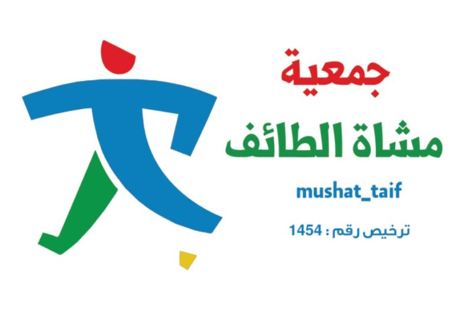

<div align="center">



# جمعية مشاة الطائف
### Mushaat At-Ta'if — Taif Walking Association

[](https://nextjs.org/)
[](https://react.dev/)
[](https://tailwindcss.com/)
[](https://www.typescriptlang.org/)

**الموقع الرسمي لجمعية مشاة الطائف** — أول جمعية متخصصة في ثقافة المشي في المملكة العربية السعودية، تعزز نمط الحياة الصحي والرياضة المجتمعية في محافظة الطائف ضمن رؤية السعودية 2030.

The official website of the Taif Walking Association — Saudi Arabia's first walking-focused nonprofit, promoting healthy lifestyles and community sports in the Taif region, aligned with Saudi Vision 2030.

[عرض الموقع](https://mush-altaif.vercel.app) · [الإبلاغ عن مشكلة](https://github.com/reda194/mush_altaif/issues) · [تواصل معنا](mailto:contact@mush-altaif.org)

</div>

---

## نظرة عامة · Overview

جمعية مشاة الطائف هي جمعية رياضية أهلية غير ربحية تهدف إلى نشر ثقافة المشي والرياضة المجتمعية في محافظة الطائف. يقدم الموقع منصة شاملة للأعضاء والمهتمين لاكتشاف مسارات المشي، ومتابعة الفعاليات، والتسجيل في البرامج المختلفة.

The Taif Walking Association is a nonprofit community sports organization promoting walking culture, hiking, and healthy living in the Taif governorate. This website serves as a comprehensive platform for members and visitors to discover trails, follow events, and register for programs.

---

## المميزات · Features

| الميزة | Feature | الوصف · Description |
|--------|---------|---------------------|
| 🏔️ بطل تفاعلي | Interactive Hero | عرض بملء الشاشة مع تأثيرات حركية وصور من الطائف |
| 📊 إحصائيات متحركة | Animated Stats | عدادات حية للأعضاء، المسافات، والمبادرات |
| 🥾 مسارات المشي | Hiking Trails | دليل تفاعلي لمسارات المشي والهايكنج في الطائف |
| 🗺️ خريطة تفاعلية | Interactive Map | خريطة OpenStreetMap مع مواقع التجمعات |
| 📸 معرض الصور | Photo Gallery | عرض دوّار لصور المسارات والفعاليات مع التشغيل التلقائي |
| ❓ أسئلة شائعة | FAQ Section | قسم أسئلة متكررة بتأثير الأكورديون |
| 📰 آخر الأخبار | Latest News | بطاقات أخبار بتصميم تحريري |
| 💬 شهادات الأعضاء | Testimonials | آراء وتجارب أعضاء الجمعية |
| 🤝 شركاؤنا | Partners | عرض شعارات الشركاء والجهات الداعمة |
| 📱 تصميم متجاوب | Responsive Design | متوافق مع جميع أحجام الشاشات والأجهزة |
| 🌙 وضع داكن | Dark Mode | دعم الوضع الداكن والفاتح |
| ↔️ دعم RTL | RTL Support | دعم كامل للغة العربية (من اليمين لليسار) |

---

## التقنيات · Tech Stack

<div align="center">

| الفئة | التقنية |
|-------|---------|
| **إطار العمل** | [Next.js 16](https://nextjs.org/) (App Router + React Compiler) |
| **واجهة المستخدم** | [React 19](https://react.dev/) |
| **التنسيق** | [Tailwind CSS v4](https://tailwindcss.com/) مع `@theme` tokens |
| **الحركة** | [Framer Motion 12](https://motion.dev/) |
| **التمرير** | [Lenis](https://lenis.darkroom.engineering/) |
| **المعرض** | [Embla Carousel](https://www.embla-carousel.com/) |
| **الخرائط** | [Leaflet](https://leafletjs.com/) + [React Leaflet](https://react-leaflet.js.org/) |
| **الأيقونات** | [Lucide React](https://lucide.dev/) |
| **التحقق** | [Zod](https://zod.dev/) |
| **الخط** | [Cairo](https://fonts.google.com/specimen/Cairo) (Google Fonts) |
| **اللغة** | [TypeScript 5](https://www.typescriptlang.org/) |
| **الاختبار** | [Playwright](https://playwright.dev/) |
| **البريد** | [EmailJS](https://www.emailjs.com/) |

</div>

---

## هيكل المشروع · Project Structure

```
mush_altaif/
├── public/                     # الأصول الثابتة · Static assets
│   ├── fonts/                  # ملفات الخطوط · Font files
│   ├── hiking/                 # صور المشي · Hiking images
│   ├── images/                 # صور عامة · General images
│   ├── trails/                 # صور المسارات · Trail images
│   ├── svg/                    # أيقونات SVG · SVG icons
│   └── logo.jpeg               # شعار الجمعية · Association logo
├── src/
│   ├── app/                    # صفحات التطبيق · App pages
│   │   ├── about/              # من نحن · About
│   │   ├── board/              # مجلس الإدارة · Board
│   │   ├── contact/            # تواصل معنا · Contact
│   │   ├── events/             # الفعاليات · Events
│   │   ├── gallery/            # المعرض · Gallery
│   │   ├── hiking/             # الهايكنج · Hiking
│   │   ├── membership/         # العضوية · Membership
│   │   ├── news/               # الأخبار · News
│   │   ├── trails/             # المسارات · Trails
│   │   ├── volunteer/          # التطوع · Volunteer
│   │   ├── globals.css         # الأنماط العامة · Global styles
│   │   ├── layout.tsx          # التخطيط الرئيسي · Root layout
│   │   └── page.tsx            # الصفحة الرئيسية · Homepage
│   ├── components/             # المكونات · Components
│   │   ├── ui/                 # مكونات واجهة المستخدم · UI primitives
│   │   ├── shared/             # مكونات مشتركة · Shared components
│   │   ├── Header.tsx          # رأس الصفحة · Header
│   │   ├── Footer.tsx          # ذيل الصفحة · Footer
│   │   ├── HeroSection.tsx     # قسم البطل · Hero
│   │   ├── StatsSection.tsx    # قسم الإحصائيات · Stats
│   │   ├── BenefitsSection.tsx # قسم الفوائد · Benefits
│   │   ├── BentoSection.tsx    # شبكة بينتو · Bento grid
│   │   ├── MapSection.tsx      # قسم الخريطة · Map
│   │   ├── TrustSection.tsx    # قسم الثقة · Trust/partners
│   │   ├── GallerySection.tsx  # قسم المعرض · Gallery
│   │   ├── FAQSection.tsx      # الأسئلة الشائعة · FAQ
│   │   ├── NewsSection.tsx     # قسم الأخبار · News
│   │   ├── TestimonialsSection.tsx  # الشهادات · Testimonials
│   │   └── CTASection.tsx      # دعوة للإجراء · CTA
│   ├── lib/                    # مساعدات · Utilities
│   └── types/                  # أنواع TypeScript · Type definitions
├── tests/                      # اختبارات · Tests
├── package.json
├── next.config.ts
├── tailwind.config.ts
└── tsconfig.json
```

---

## البدء · Getting Started

### المتطلبات · Prerequisites

- **Node.js** ≥ 18
- **npm** ≥ 9 (أو yarn / pnpm / bun)

### التثبيت · Installation

```bash
git clone https://github.com/reda194/mush_altaif.git
cd mush_altaif
npm install
```

### الإعداد · Environment Setup

```bash
cp .env.local.example .env.local
# عدّل ملف .env.local بإعداداتك · Edit .env.local with your settings
```

### التشغيل · Development

```bash
npm run dev
```

افتح [http://localhost:3000](http://localhost:3000) في المتصفح.

### البناء · Build

```bash
npm run build
npm start
```

---

## الأوامر · Scripts

| الأمر | Command | الوصف · Description |
|-------|---------|---------------------|
| `npm run dev` | Development | تشغيل خادم التطوير |
| `npm run build` | Build | بناء النسخة الإنتاجية |
| `npm start` | Production | تشغيل خادم الإنتاج |
| `npm run lint` | Lint | فحص جودة الكود |
| `npx playwright test` | Test | تشغيل اختبارات E2E |

---

## أقسام الصفحة الرئيسية · Homepage Sections

<details>
<summary>📋 عرض تفاصيل الأقسام · View section details</summary>

| # | القسم | الوصف |
|---|-------|-------|
| 1 | **Hero** | عرض بملء الشاشة مع صورة وطنية وشعار متحرك |
| 2 | **Stats** | إحصائيات متحركة (3500+ عضو، 120K+ كم، 45 مبادرة) |
| 3 | **Benefits** | ثلاث بطاقات: الصحة البدنية، الصفاء الذهني، التواصل الاجتماعي |
| 4 | **Bento** | شبكة بينتو: العضوية، الحوكمة، الفعاليات، دليل المسارات |
| 5 | **Map** | خريطة تفاعلية مركزها الطائف مع بطاقة معلومات |
| 6 | **Trust** | شعارات الشركاء (المركز الوطني، وزارة الرياضة، رؤية 2030) |
| 7 | **Gallery** | عرض دوّار لصور المسارات |
| 8 | **FAQ** | أسئلة متكررة بأكورديون |
| 9 | **News** | بطاقات أخبار بتصميم تحريري |
| 10 | **Testimonials** | شهادات أعضاء الجمعية |
| 11 | **CTA** | بانر دعوة للتسجيل |

</details>

---

## النشر · Deployment

الموقع منشور على **Vercel** مع تكامل تلقائي مع GitHub:

[](https://vercel.com/new/clone?repository-url=https://github.com/reda194/mush_altaif)

راجع [توثيق نشر Next.js](https://nextjs.org/docs/app/building-your-application/deploying) لمزيد من التفاصيل.

---

## المساهمة · Contributing

نرحب بمساهماتكم! يرجى اتباع الخطوات التالية:

1. **Fork** المشروع
2. أنشئ فرع جديد (`git checkout -b feature/your-feature`)
3. التزم بالتغييرات (`git commit -m 'Add your feature'`)
4. ادفع الفرع (`git push origin feature/your-feature`)
5. افتح **Pull Request**

---

## الرخصة · License

هذا المشروع خاص ومرخّص لجمعية مشاة الطائف. جميع الحقوق محفوظة.

---

<div align="center">

**صُنع بـ ❤️ لجمعية مشاة الطائف** · Made with ❤️ for Taif Walking Association

[GitHub](https://github.com/reda194/mush_altaif) · [الموقع](https://mush-altaif.vercel.app) · [تواصل معنا](mailto:contact@mush-altaif.org)

</div>
